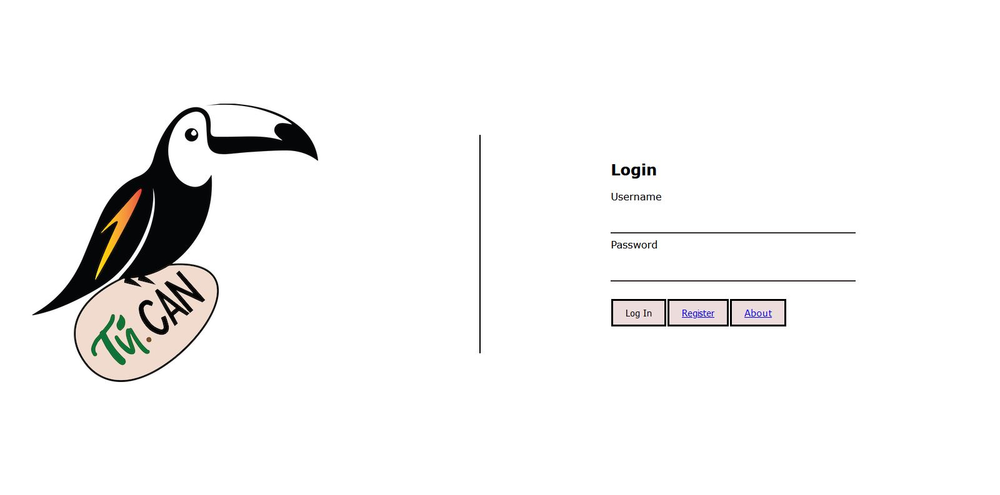
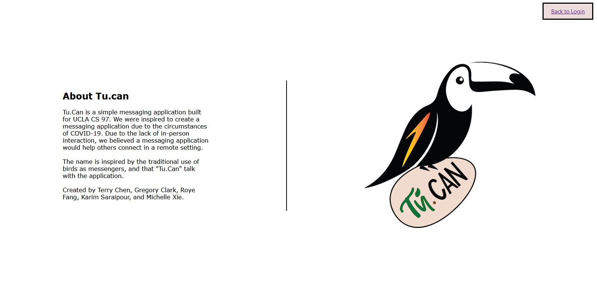
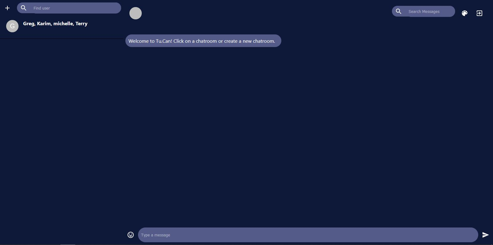
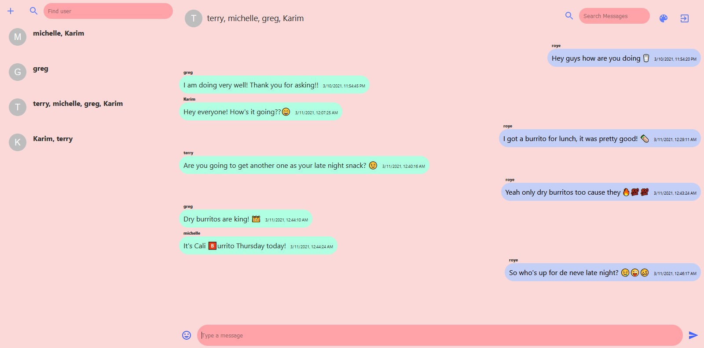
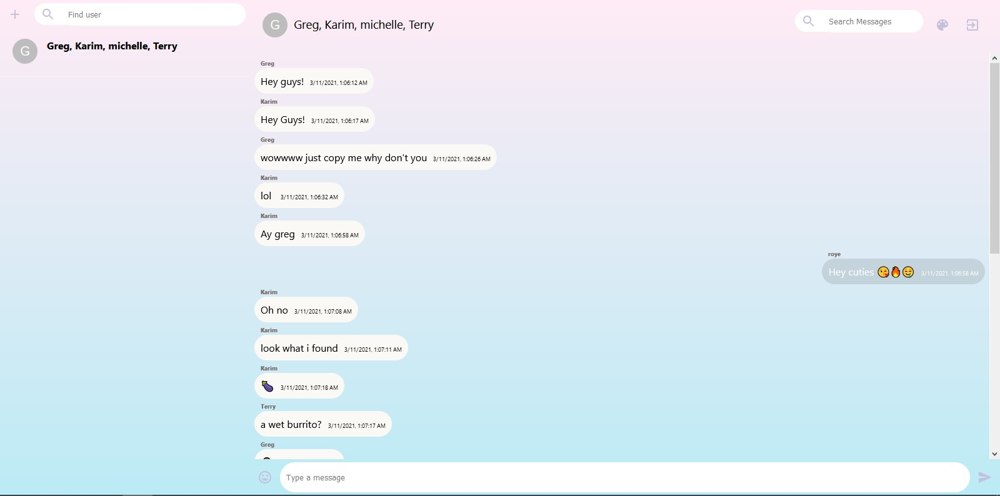
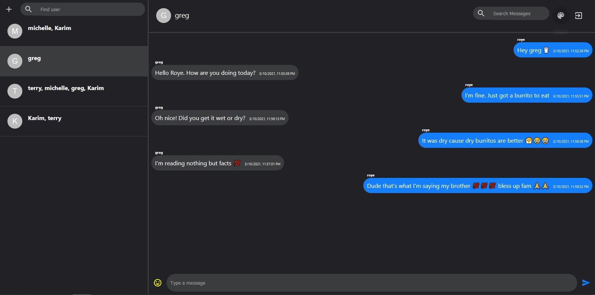

# Tu.Can 🐦
Tu.Can is a messaging web application designed for simplicity and minimalism.

## Features
* Registering a unique user account
* Creating private or group chatrooms
* Emoji dropdown menu
* 5+ unique themes</br>

## Technology Stack
* React 
* Node/Express
* MongoDB

## Getting Started

### Requirements

[Node.js 14.16.0 LTS](https://nodejs.org/en/) or higher

### Build
```
$ git clone https://github.com/Greg-Clark/Tu.Can.git
$ cd CS97Project/cs97project
$ npm install
```

### Run
```
$ npm run dev
```

## Demo
 | 
|:---:|:---:|
 | 
 | 

## About
Tu.Can is a simple messaging application built for UCLA CS 97. We were inspired to create a messaging application due to the circumstances of COVID-19. Due to the lack of in-person interaction, we believed a messaging application would help others connect in a remote setting.<br/>

The name is inspired by the traditional use of birds as messengers, and that "Tu.Can" talk with the application.<br/>

Some challenges we came across during the project included registering unique users, excluding unregistered users from chatrooms, and having to learn technologies on our own. Aside from technical challenges, we also faced logistical challenges including time management, communication with group members, and leveraging version control.</br>

Future improvements include enforcing safer passwords, notifications when receiving a message, and general code optimizations.<br/>

Created by Karim Saraipour 🌯, Michelle Xie 🐐, Gregory Clark 🍎, Roye Fang 🥛, and Terry Chen 🍳
